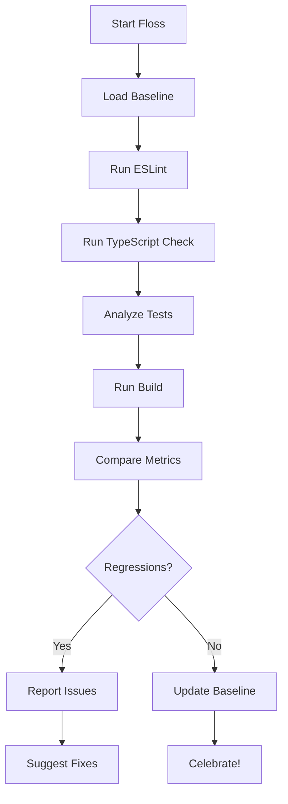

# Floss Codebase - Comprehensive Code Quality Enforcement

Ensures zero linter warnings, zero TypeScript errors, monotonically increasing test coverage, meaningful tests, and successful builds. Never allows quality to degrade.

## Usage

```
/project:floss-codebase [options]
```

## Options

- `--fix` - Automatically fix safe linter issues
- `--baseline` - Set current state as baseline (overrides auto-detection)
- `--strict` - Fail on any regression, even minor
- `--verbose` - Show detailed output for all checks

## Automatic Baseline Detection

When running on a feature branch without an existing baseline, the command will:

1. Stash any uncommitted changes
2. Switch to the parent branch (main/master)
3. Run all checks to establish baseline metrics
4. Return to your branch and restore changes
5. Compare your branch against the parent baseline

This ensures you're always comparing against the clean state of the branch you're merging into!

## What It Does

1. **Linter Deep Clean** 🧹
   - Runs ESLint on entire codebase
   - Reports ALL warnings (not just errors)
   - Tracks warning counts by category
   - Auto-fixes safe issues with --fix

2. **TypeScript Hygiene** 🔍
   - Full type checking with strict mode
   - Zero tolerance for type errors
   - Catches implicit any, unused vars, etc.
   - Reports type coverage percentage

3. **Test Quality Guardian** 🧪
   - Ensures test count never decreases
   - Validates tests contain actual assertions
   - Finds and reports dummy/empty tests
   - Checks for .skip/.only in committed code
   - Tracks test-to-code ratio

4. **Build Integrity** 🏗️
   - Runs full production build
   - Ensures zero build errors
   - Monitors bundle sizes
   - Validates all imports resolve

5. **Progress Tracking** 📊
   - Maintains metrics history
   - Shows trends over time
   - Celebrates improvements
   - Alerts on any regression

## Workflow



## Metrics Tracked

- Total ESLint warnings by rule
- TypeScript error count
- Type coverage percentage
- Total test files
- Total test cases
- Passing/failing tests
- Tests with assertions
- Average assertions per test
- Build time
- Bundle sizes

## Example Output

```
🦷 FLOSS CODEBASE REPORT
========================

📊 Metrics Summary:
  ESLint:     0 warnings (↓ 12 from baseline) ✅
  TypeScript: 0 errors (stable) ✅
  Tests:      847 total (↑ 23 from baseline) ✅
  Build:      Success in 45.2s ✅

🎯 Test Quality:
  Files with tests: 89/103 (86.4%)
  Tests with assertions: 823/847 (97.2%)
  Avg assertions/test: 3.4
  No .skip or .only found ✅

📈 Trends (last 7 runs):
  Warnings:  45 → 32 → 18 → 12 → 5 → 2 → 0 🎉
  Tests:     824 → 824 → 835 → 841 → 844 → 844 → 847

✨ All quality checks passed! Your code is sparkling clean!
```

## Enforcement Rules

1. **Never Allow Regressions**
   - Test count must never decrease
   - Warning count must never increase
   - Type errors must stay at zero
   - Build must always succeed

2. **Require Meaningful Tests**
   - Every test must have ≥1 assertion
   - No empty describe blocks
   - No commented-out tests
   - Descriptive test names required

3. **Maintain Momentum**
   - Each run should show improvement
   - Track velocity of fixes
   - Highlight areas needing attention

## Implementation Details

The command:

1. Runs all checks in parallel where possible
2. Caches results for quick re-runs
3. Provides actionable fix suggestions
4. Integrates with CI/CD workflows
5. Maintains branch-specific history in `.claude/floss-history-{branch-name}.json`
6. Automatically detects parent branch for baseline comparison
7. Handles git operations safely with stash/restore

## Quick Fixes

When issues are found, the command provides:

- Exact commands to fix linter warnings
- Type error explanations with examples
- Test improvement suggestions
- Links to relevant documentation

### TypeScript Best Practices Integration

When TypeScript errors are detected, the command:

1. Identifies specific error codes (e.g., TS2322, TS2339)
2. Maps them to relevant sections in `.claude/typescript-best-practices.md`
3. Displays targeted guidance for your specific errors
4. Shows code examples and proper patterns to follow

Example error guidance:

- **TS2322** (Type Assignment): Shows Prisma JSON handling patterns
- **TS2339** (Property Access): Displays type guard examples
- **TS2741** (Missing Properties): Shows test mocking patterns
- **TS7006** (Implicit Any): Reminds to use `unknown` instead

## Integration

Add to your workflow:

- Run before every commit
- Include in PR checks
- Schedule daily runs
- Track team metrics

Remember: A clean codebase is a happy codebase! 🌟
